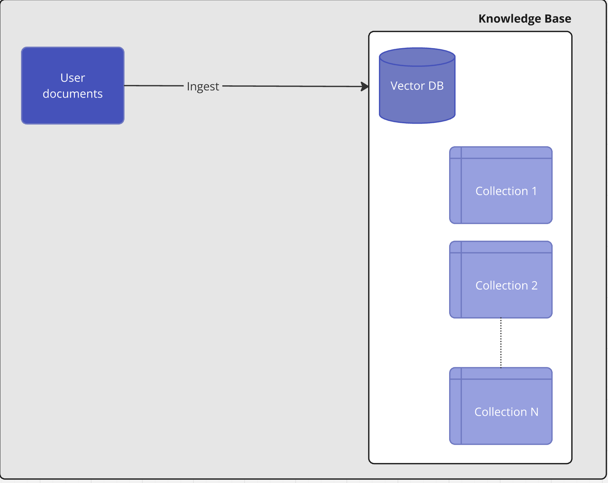
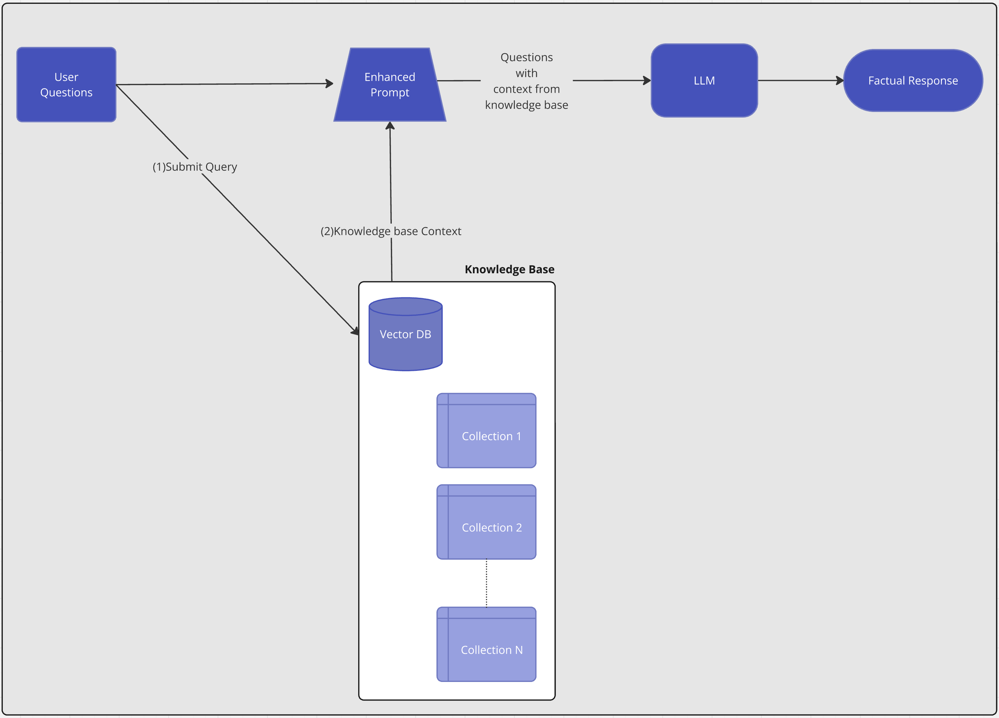

# Chat with your doc 

This is an updated version of the [LLM Chatbot Augmented with Enterprise Data AMP](https://github.com/cloudera/CML_AMP_LLM_Chatbot_Augmented_with_Enterprise_Data/tree/main).

This repository demonstrates how to use an open source pre-trained instruction-following LLM (Large Language Model) to build a ChatBot. The responses of the LLM are enhanced by giving it context from an internal knowledge base created from the documents uploaded by the users. This context is retrieved by using an open source Vector Database to do semantic search.

Compared to the original LLM Chatbot Augmented with Enterprise Data AMP, this version added the support for user document ingestion, automatic question generation and result streaming. It also uses llama index for RAG pipeline implementation.

Watch the Chatbot in action [here](<>).

All the components of the application (knowledge base, context retrieval, prompt enhancement LLM) are running within CML. This application does not call any external model APIs nor require any additional training of an LLM. 

> **IMPORTANT**: Please read the following before proceeding.  By configuring and launching this AMP, you will download TheBloke/Mistral-7B-Instruct-v0.2, which is a third party large language model (LLM) into your environment from the third party’s website.  Please see https://huggingface.co/TheBloke/Mistral-7B-Instruct-v0.2-GGUF for more information about the LLM, including the applicable license terms.  If you do not wish to download and install TheBloke/Mistral-7B-Instruct-v0.2, do not deploy this repository.  By deploying this repository, you acknowledge the foregoing statement and agree that Cloudera is not responsible or liable in any way for TheBloke/Mistral-7B-Instruct-v0.2. Author: Cloudera Inc.

## Table of Contents 
#### README
* [Enhancing Chatbot with Enterprise Context to reduce hallucination](#enhancing-chatbot-with-enterprise-context-to-reduce-hallucination)
  * [Retrieval Augmented Generation (RAG) Architecture](#retrieval-augmented-generation--rag--architecture)
* [Requirements](#requirements)
* [Project Structure](#project-structure)
  * [Implementation](#implementation)
* [Technologies Used](#technologies-used)

## Enhancing Chatbot with Context to reduce hallucination
When a user question is directly sent to the open-source LLM, there is increased potential for halliucinated responses based on the generic dataset the LLM was trained on. By enhancing the user input with context retrieved from a knowledge base, the LLM can more readily generate a response with factual content. This is a form of Retrieval Augmented Generation.

For more detailed description of architectures like this and how it can enhance NLP tasks see this paper: [Retrieval-Augmented Generation for Knowledge-Intensive NLP Tasks
](https://arxiv.org/abs/2005.11401)


### Retrieval Augmented Generation (RAG) Architecture
- Document Ingest into Vector Database
  - The UI allows the usres to upload the document in html, pdf and txt format
  - Generate embeddings with an open sourced pretrained model for each of the uploaded files
  - Store those embeddings along with document IDs in a Vector Database to enable semantic search
- Augmenting User Question with Additional Context from Knowledge Base
  - Given user question, search the Vector Database for documents that are semantically closest based on embeddings
  - Retrieve context based on document IDs and embeddings returned in the search response
- Submit Enhanced prompt to LLM to generate a factual response
  - Create a prompt including the retrieved context and the user question
  - Stream the LLM response in a web application

#### Document Ingestion


#### Retrieval Augmented Generation


## Requirements
#### CML Instance Types
- A GPU instance is preferred to perform inference on the LLM
  - [CML Documentation: GPUs](https://docs.cloudera.com/machine-learning/cloud/gpu/topics/ml-gpu.html)
- A CUDA 5.0+ capable GPU instance type is recommended
  - The torch libraries in this AMP require a GPU with CUDA compute capability 5.0 or higher. (i.e. nVidia V100, A100, T4 GPUs)

> **IMPORTANT**: While the GPU instance is preferred to perform inference on the LLM, the LLM can be configured to use only the CPU. Inference will be very slow with CPU only mode and is not recomented.

#### Resource Requirements
This AMP creates the following workloads with resource requirements:
- CML Session: `1 CPU, 4GB MEM`
- CML Jobs: `1 CPU, 4GB MEM`
- CML Application: `2 CPU, 1 GPU, 16GB MEM`

#### External Resources
This AMP requires pip packages and models from huggingface. Depending on your CML networking setup, you may need to whitelist some domains:
- pypi.python.org
- pypi.org
- pythonhosted.org
- huggingface.co

## Project Structure
### Folder Structure

The project is organized with the following folder structure:
```
.
├── 0_session-resource-validation/  # Script for checking CML workspace requirements
├── 1_session-install-deps/   # Setup script for installing python dependencies
├── 2_job-download-models/    # Setup scripts for downloading pre-trained models
├── 3_job-populate-vectordb/  # Setup scripts for initializing and populating a vector database with context documents
├── 4_app/                    # Backend scripts for launching chat webapp and making requests to locally running pre-trained models
|── assets/                   # Static assets for the application
├── utils/                    # Python module for functions used for interacting with pre-trained models
├── images/
├── README.md
└── LICENSE.txt
```
## Implementation

### `1_session-install-deps`
- Install python dependencies specified in 1_session-install-deps/requirements.txt

### `2_job-download-models`
Definition of the job **Download Models** 
- Directly download specified models from huggingface repositories
- These are pulled to new directories models/llm-model and models/embedding-model

### `3_job-populate-vectordb`
Definition of the job **Populate Vector DB with documents embeddings**
- Start the milvus vector database and set database to be persisted in new directory milvus-data/
- Generate embeddings for each document in data/
- The embeddings vector for each document is inserted into the vector database
- Stop the vector database

### `4_app`
Definition of the application `CML LLM Chatbot`
- Start the milvus vector database using persisted database data in milvus-data/
- Load locally persisted pre-trained models from models/llm-model and models/embedding-model 
- Start gradio interface 
- The chat interface performs both retrieval-augmented LLM generation and regular LLM generation for bot responses.

## Technologies Used
#### Open-Source Models and Utilities
- [thenlper/gte-large](https://huggingface.co/thenlper/gte-large)
     - Vector Embeddings Generation Model
- [TheBloke/Mistral-7B-Instruct-v0.2-GGUF](https://huggingface.co/TheBloke/Mistral-7B-Instruct-v0.2-GGUF)
   - Instruction-following Large Language Model
- [Hugging Face transformers library](https://pypi.org/project/transformers/)
#### RAG pipeline implementation
- [LlamaIndex](https://docs.llamaindex.ai/en/stable/)
#### Vector Database
- [Milvus](https://github.com/milvus-io/milvus)
#### Chat Frontend
- [Streamlit](https://streamlit.io/)

## Deploying on CML
There are two ways to launch this prototype on CML:

1. **As ML Prototype** - In a CML workspace, click "New Project", add a Project Name, select "ML Prototype" as the Initial Setup option, copy in the [repo URL](https://github.com/cloudera/CML_AMP_LLM_Chatbot_Augmented_with_Enterprise_Data), click "Create Project", click "Configure Project"